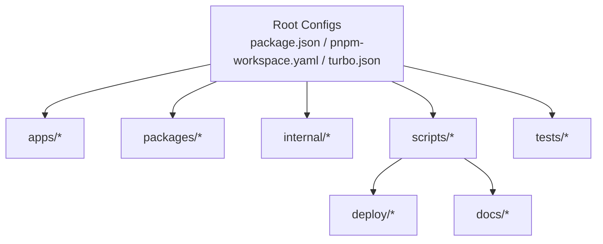
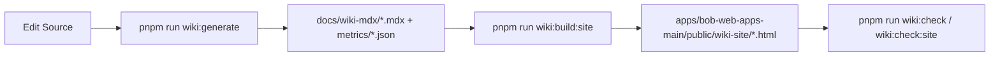

{/* AUTO-GENERATED: Do not edit manually. Use `pnpm --filter @repo/wiki run sync:en` after `wiki:generate`. */}

> Auto-generated English skeleton.
> Source (zh-TW): `../01-architecture.mdx`
> Translation mode: draft (manual translation required).
{/* AUTO-GENERATED: Do not edit manually. Use `pnpm run wiki:generate`. */}
# 架構與建置系統

## 文件定位
定義 monorepo 分層、workspace 規則、Turbo 任務契約。

## 更新摘要
- 本文件由程式碼與設定檔事實自動生成，不依賴人工手寫敘述。
- 排序與格式固定，確保重複生成輸出一致（deterministic）。
- CI Gate 使用 `wiki:check` 驗證文件是否與程式碼同步。

## 文件中繼資料
| 欄位 | 內容 |
| --- | --- |
| 產生器 | `node scripts/wiki/generate.mjs --mdx` |
| 驗證指令 | `node scripts/wiki/generate.mjs --check --mdx` |
| 輸出範圍 | `docs/wiki-mdx/*` |
| 核心來源 | `package.json`, `pnpm-workspace.yaml`, `turbo.json`, `Jenkinsfile` |

## 引用檔案
- [package.json](../../package.json)
- [pnpm-workspace.yaml](../../pnpm-workspace.yaml)
- [turbo.json](../../turbo.json)
- [apps/bob-web-apps-main/package.json](../../apps/bob-web-apps-main/package.json)
- [scripts/verify/repo-layout.config.json](../../scripts/verify/repo-layout.config.json)

## 章節目錄
1. [架構原則](#架構原則)
2. [分層責任矩陣](#分層責任矩陣)
3. [Workspace 規則](#workspace-規則)
4. [Turbo 任務契約](#turbo-任務契約)
5. [系統示意圖](#系統示意圖)

## 架構原則
- 已納管 workspace 以 `pnpm -r list --depth -1 --json` 為唯一事實來源。
- `turbo.json` 定義任務拓撲、快取與輸出契約。
- `scripts/verify/repo-layout.config.json` 定義 nested git 邊界與治理責任。

## 分層責任矩陣
| 路徑 | 責任 |
| --- | --- |
| apps/ | 可部署應用與執行入口 |
| packages/ | 可重用模組與業務套件 |
| internal/ | 共享 lint/build/config 基礎設施 |
| scripts/ | repo 維運工具與治理腳本 |
| tests/ | 跨 workspace E2E / 整合驗證 |
| deploy/ | Kubernetes 部署清單 |
| docs/ | 治理與知識文件 |

## Workspace 規則
### Include Patterns
| 規則 |
| --- |
| apps/bff_gateway |
| apps/mobile_flutter |
| scripts/wiki |

### Exclude Patterns
| 規則 |
| --- |
| (none) |

## Turbo 任務契約
| 任務 | dependsOn | outputs | cache | persistent |
| --- | --- | --- | --- | --- |
| build | ^build | dist/**, build/** | enabled/default | false |
| build:site | generate | apps/public/wiki-site/** | enabled/default | false |
| check | generate | - | enabled/default | false |
| check:en | sync:en | - | enabled/default | false |
| check:site | build:site | - | enabled/default | false |
| generate | - | docs/wiki-mdx/** | enabled/default | false |
| lint | - | - | enabled/default | false |
| sync:en | generate | docs/wiki-mdx/en-US/** | enabled/default | false |
| test | ^build | coverage/** | enabled/default | false |

## 系統示意圖


## Mermaid Workflow


## File Structure
```text
.
|-- docs/
|   |-- engineering/
|   `-- wiki-mdx/
|       |-- *.mdx
|       |-- workspaces/
|       |-- domains/
|       |-- metrics/
|       `-- en-US/
|-- scripts/
|   `-- wiki/
|       |-- generate.mjs
|       |-- sync-en.mjs
|       `-- build-site.mjs
`-- apps/
    `-- bob-web-apps-main/public/wiki-site/
```
